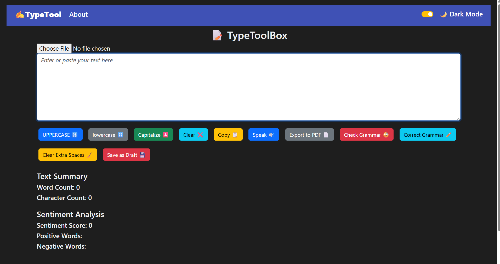
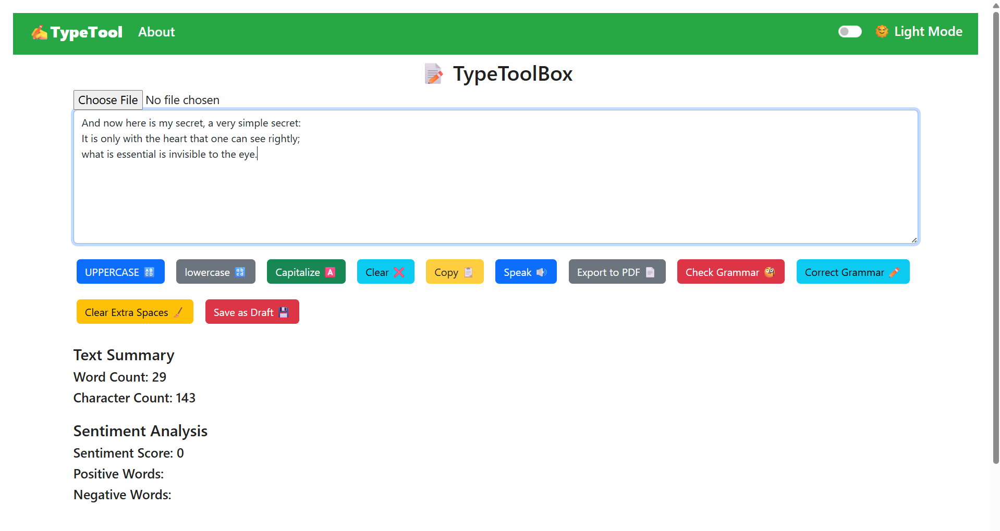
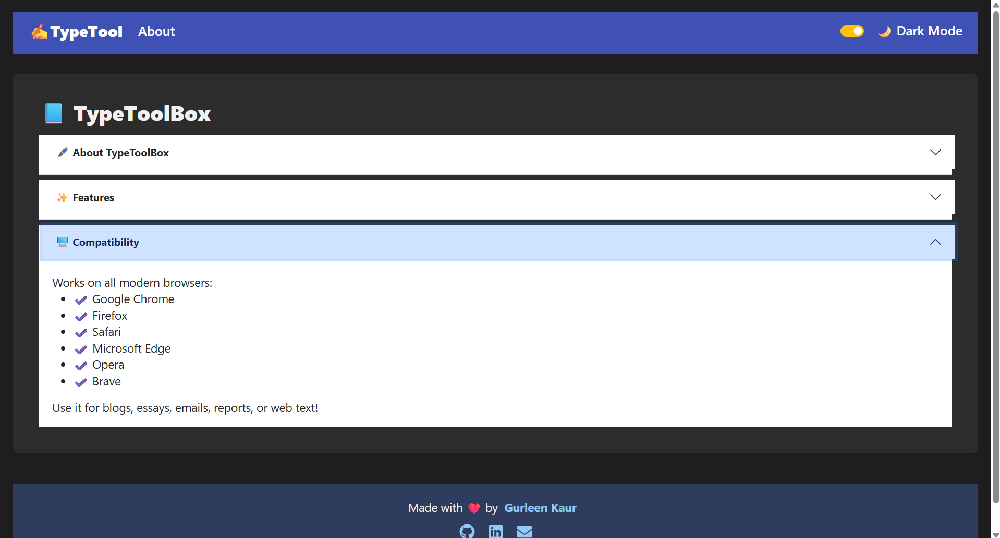

# ✍️ TypeToolbox

**TypeToolbox** is a modern, responsive text utility web application powered by React and AI. It allows users to correct grammar, analyze sentiment, and format text in various ways—all in one place. Built as a smarter alternative to basic text editors and inspired by tools like QuillBot and Grammarly.

🔗 **Live Demo:** [typetoolbox.netlify.app](https://typetoolbox.netlify.app)

---

## 🧠 Features

- 🔠 Convert text to UPPERCASE
- 🔡 Convert text to lowercase
- 🅰️ Capitalize each word
- 📋 Copy text to clipboard
- 🧹 Remove extra/unnecessary spaces
- 🔊 Read the text aloud (Text-to-Speech)
- 🧠 Grammar checking using the LanguageTool API
- 📈 Sentiment analysis using NLP
- 📄 Export content as PDF using jsPDF
- 📊 Count words, characters, and spaces
- 💡 Auto-load last saved draft on refresh
- 💾 Save current text as a draft using localStorage
- 📂 Upload .txt, .docx, and .pdf files and extract text
- 💡 Auto-load last saved draft on refresh
- 💬 Display grammar suggestions with replacements
- 🌙 Light/Dark theme toggle

---

## 📷 Screenshots

### Home Page with Dark Theme
 

### Implementaion of website with Light Theme
 

### About Page
 

---

## 🚀 Getting Started (Local Setup)

Clone the repo  
```bash
git clone https://github.com/yourusername/typetoolbox.git
cd typetoolbox
```

